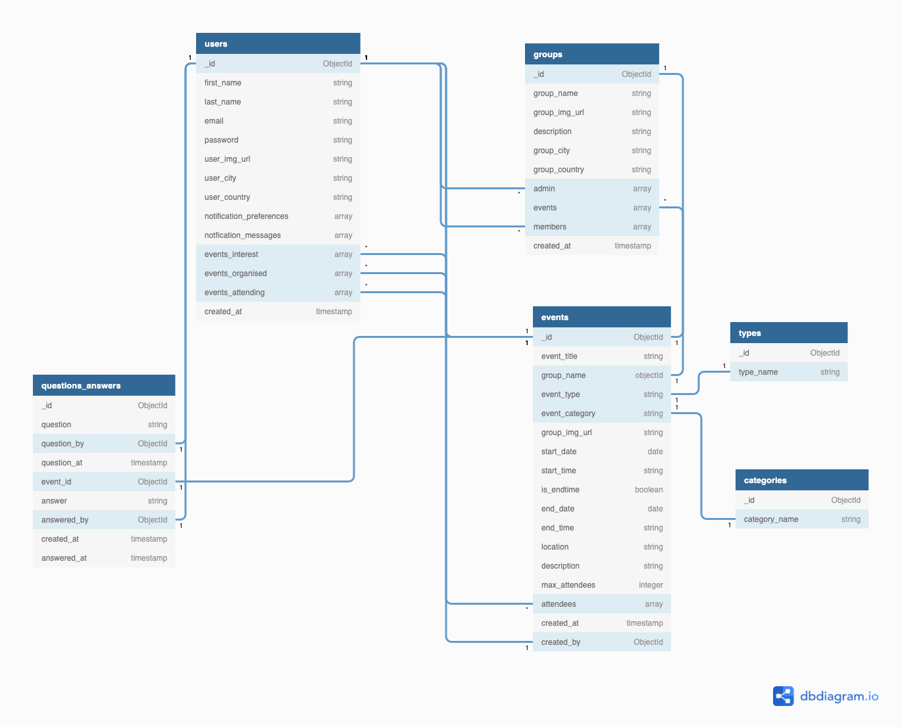
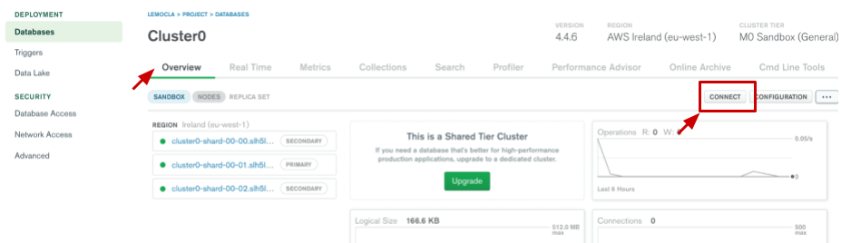
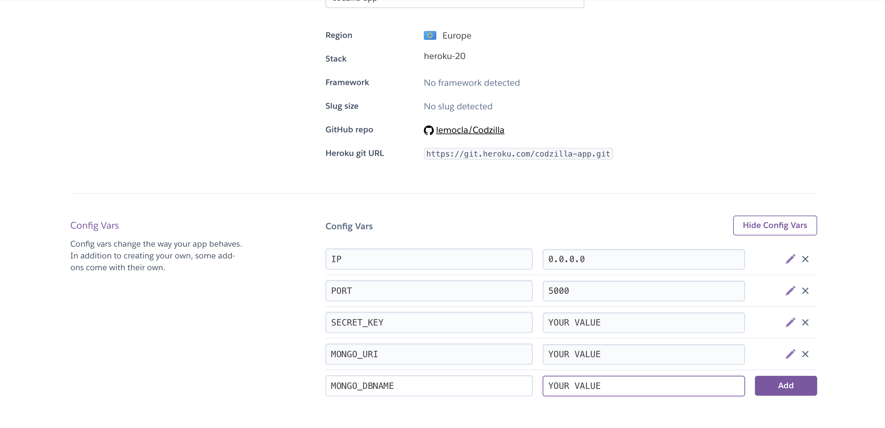

# **MS3 - Codzilla**

## **Introduction** 

Codizilla -  an online meetup-planning platform - was created for educational purposes only as part of the Code Institute’s full stack development course.

Using the principles of UX design, this fully responsive and interactive website was developed using HTML, CSS, JavaScript, Python, Flask and MongoDB. 

[View live project here](https://codzilla-app.herokuapp.com/)

## **Table of content** 

  - [UX Design](#ux-design)
    - [Strategy](#strategy)
    - [User stories](#user-stories)
    - [Scope](#scope)
    - [Structure](#structure)
    - [Skeleton](#skeleton)
    - [Design](#design)
  - [Features](#features)
    - [Existing features](#existing-features)
    - [Features left to implement](#features-left-to-implement)
  - [Technologies Used](#technology-used)
    - [Languages](#languages)
    - [Database](#database)
    - [Libraries, frameworks and other technologies](#libraries-frameworks-and-other-technologies)
  - [Code organisation](#code-organisation)
  - [Data validation](#data-validation)
  - [Testing](#testing)
  - [Deployment](#deployment)
    - [Deployment of the page](#deployment-of-the-page)
    - [How to run the code locally](#how-to-run-the-code-locally)
   - [Credits](#credits)
     - [Code](#code)
     - [Content](#content)
     - [Media](#media)
     - [Acknowledgment](#acknowledgments)

# **UX DESIGN**

- ## **Strategy** 

    Codizilla is an online event-planning platform, aimed at developers who, regardless of their experience, want to organise and participate in meetups in order to extend their skills, network and portfolio around:
    - a group or open-source project, 
    - a study group to learn and expand on a specific language or framework 
    - a working group to help each others with cvs and cover letters or
    - to simply meet and socialize    
    
    The site owner, as a remote student on a full-stack development course, appreciates that it can be a lonely process and has enjoyed meeting with fellow students on the course, working and socializing together on an array of projects. 

    **Site owner goal**

    - To provide an easy and engaging community platform where users can create and join meetups
    - To expand on software development skills using Python, Flask and MongoDB
    - To create a Minimum Viable Product that can be further developed with additional features   

    **User goals** 

    - To access a user-friendly website across multiple devices 
    - To build a community with other developers around shared-interests and collaborative projects by joining and/or organising meetups. 

- ## **User stories** 

    **As a new user:** 
    - I want a responsive website so that I can access it on different devices.
    - I want to easily navigate across the site so that I can find the information I need.
    - I want to search events without having to register so that I can assess if this website is for me
    - I want to view details for an event so that I can see all the practical information 
    - I want to sign-up on the website so that I can join or organise an event
    - I want to read about how to use this website so that I can make the most of the features on offer.  

    **As a returning user:** 
    - I want to login onto the website so that I can make use of all the features on the website 
    - I want to be able to edit my profile so that I can update my personal information
    - I want to set my preferences for my notification so that I don’t miss important information
    - I want to reset my password if I forgot it so that I can access my account
    - I want to be able to delete my profile so that my personal information is removed from the website        

    **As an event organiser:**
    - I want to create a group so that my events are easier to find
    - I want to easily create an event so that I can start meeting with other users
    - I want to view events that I have created so that I can manage my events
    - I want to post an answer to a question about a meetup I’m organising so that I can offer more details about the event.   

    **As a meetup participant:**
    - I want to easily join an event so that I can start meeting other users 
    - I want to be able to ask a question about the event  so that I can get more details about the event
    - I want to cancel my participation to an event
    - I want to view the events that I am planning to attend    

    **As a frequent user:**
    - I want to contact the site owner so that I can make queries about the website
    - I want to be able to edit an event so that I can reschedule or update details about the event
    - I want to be able to cancel an event so that attendees can get notified of the cancellation
    - I want to be able to delete an event so that I can manage my account more effectively
    - I want to view important notifications about my events so that I keep up-to-date.

- ## **Scope** 

    - ### **Feature trade-off**

        

        This website will be developed as a minimal viable product with room for future improvements and releases incorporating additional features.

    - ### **Functional requirements**
        - To be able to sign-up using email address and secure password
        - To be able to login 
        - To be able to add/view/edit/delete profile information and preferences
        - To be able to reset password 
        - To be able to add/view/edit/delete an event 
        - To be able to add/view/edit/delete a group
        - To be able to cancel an event 
        - To be able to search events according to keyword and set of criteria
        - To be able to sort meetup according to a set of criteria 
        - To be able to display search results 
        - To be able to add/view/edit/delete a question 
        - To be able to add/view/edit/delete an answer 
        - To be able to notify users when an event is about to take place, when an event has been changed or cancelled and when a question has been asked / answered
        - To be able to share events on social media
        - To be able to store and retrieve images 
        - To be able to contact the site owner 
        - To receive feedback for important actions: create - update - delete
        - Page 404 Not Found
        - Page 500 Internal Server Error page 

	- ### **Non functional requirements**
	
      - Display event location on a map
      - Display profile and event images 

    - ### **Content requirements**
        - Clear and concise information on how to use the website 
        - Forms for user input 
        - Engaging text and headings throughout to display relevant user input such as profile page, events and groups as well as questions and answers
        - Background images to provide visually appealing and engaging interface
        - Icons for interactive and visual elements 

    - ### **Constraints**
	
      **Technical skills:**   
      The site owner is still learning Python, Flask and MongoD, which may impact on the successful implementation of the planned features. 

      **Time:**     
      Implementing features using new technical skills will require time and careful planning. 

- ## **Structure**

    - ### **Information architecture**

         
         Link to document (png format) [here](documentation/structure/architecture.png)

    - ### **Website workflow**

        
         Link to document (png format) [here](documentation/structure/workflow.png) 

    - ### **Organisation of functionality and content**

      **Header:** Logo and a collapsible menu for guest users. Once users are logged in, they will have access to certain functionality such as notification and add an event. Users will also have easy access to their profile, their events as well as their groups.   

      **Homepage:** Search option, information about and how to use the website as well as a carousel of upcoming events,
    
      **Footer:** Contact form and useful links
    
      **All events and groups:** list of all events with search and sort option. Each event card will include important information: event title, date & time, location, number of attendees.
    
      **Event and group detail pages:** display all the information relevant event / group
    
      **Profile page:** to display all the relevant information about a user
    
      **View my events pages:** to display a summary of all the events organised as well events the user is attending / interested in.

      **View my group page:** to display a summary of all the groups for which the user is either a member or an organiser. 

      Other pages will have the primary purpose to collect information add/ edit information stored on the database such as user profile, events and groups.

    - ### **Interaction design**

        - Collapsible menu
        - Modal forms for editing profile and contact us page 
        - Buttons and content cards with hovering effects 
        - Icons with hovering effect

    - ### **Database structure**

        Database schema was designed using [diagram.io](https://dbdiagram.io). 

        

          

        Link to document (png format) [here](documentation/structure/db_structure.png) 

        - #### **JSON Schema validation**
        
          - JSON Schema validation was generated with MongoDB Realm to which additional details were added such as description, unique values and required fields. 

          - **JSON Schema**
            - [user_schema](documentation/structure/user_schema.json)
            - [event_schema](documentation/structure/event_schema.json)
            - [group_schema](documentation/structure/group_schema.json)
            - [question_answer_schema](documentation/structure/question_answer.json)
            - [category_schema](documentation/structure/category_schema.json)
            - [type_schema](documentation/structure/type_schema.json)       

        (this may evolve to adjust to the application requirements)

    - #### **Differences** 
      - Notifications are stored in a dedicated collection rather than being nested in the user collection, to allow notification for multiple users.
      - An additional collection for event status - active/cancelled was also included to ensure consistency.

- ## **Skeleton**

    **Homepage wireframe** 

    
    Link to homepage wireframe (png format) [here](ocumentation/wireframes/homepage_guest_user.png) 

    Please find below links to a selection of wireframe for this project. 
    - [Sign in page wireframe](documentation/wireframes/login_page.png) 
    - [Sign up page wireframe](documentation/wireframes/sign_up_page.png) 
    - [Complete profile wireframe](documentation/wireframes/complete_profile.png) 
    - [Profile completed wireframe](documentation/wireframes/profile_completed.png) 
    - [All events and groups wireframe](documentation/wireframes/all_events_and_groups.png) 
    - [Add / edit an event wireframe](documentation/wireframes/create_edit_event.png) 
    - [Add / edit a group wireframe](documentation/wireframes/create_a_group.png) 
    - [Profile page](documentation/wireframes/profile_page.png)
    - [Edit profile modals wireframe](documentation/wireframes/profile_edit_modals.png) 
    - [My events wireframe](documentation/wireframes/my_events.png) 
    - [My groups wireframe](documentation/wireframes/my_groups.png) 
    - [Notification](documentation/wireframes/notification.png) 

    Please find all the wireframes in pdf format [here](documentation/wireframes/wireframes_all.pdf)

    #### **Difference to design**

     - The notification layout differs from wireframes and feature shorter messages without any imagery.
     - Filters to search area were not implemented at this stage.

- ## **Design** 

    The website will feature a simple, modern and engaging design, with minimum colours and imagery to keep the emphasis on the events and information displayed.

    - #### **Imagery**

    - #### **Colour scheme**

      The website will use the following colour palette, which was customed made using  and checked for accessibility using [Adobe Color](https://color.adobe.com/create/color-wheel) 
      

      Colours will be used sparingly throughout the website. 

      The colour blue will be used for icons and buttons to inform users with regards to their interest and participation into groups and events. 
      
      Fuchsia will be used for the logo and was selected for its bright and bold appearance offering a striking contrast with the blue. It will also be used to highlight certain text elements. 

    - #### **Typography**

      The website will use the following fonts from [Google](https://fonts.google.com/):
      - Open sans for the text throughout due its friendly appearance and being easy to read. 
      - Roboto for headings as it complements Open sans very nicely 
      - Tourney for the logo for its technological aspect. 

    - #### **Icons**
      Icons by [font-awesome](https://fontawesome.com/) will be used in the navigation bar to allow user to quickly access functionalities offered by the website once logged-in. 

    - #### **Styling**

      - Horizontal lines to structure and make the content of the website easy to read.
      - Rounded edge borders and buttons for a more user friendly and inviting interface.

    - #### **Difference to design** 

      Additional grey colours were used to add structure to the page.

# **FEATURES**

  - ## **Implemented features** 

     Existing features can be found in the document [feature.md](documentation/features.md).

  - ## **Features left to implement**   

     - Further authentication on registration by asking the user to confirm their email address
     - Add email notifications and amend user preference accordingly 
     - Allow group owners to add co-admin to their group 
     - Allow users to share events on social media 
     - Implement a discussion feature on group so that users can exchange 
     - Upload, store and retrieve images for groups and events as well as for profile image 
     - Filter search results by location, topic and dates.
     - Add pagination for groups and events

# **TECHNOLOGY USED**

  - ## **Languages**
    - HTML
    - CSS
    - Javascript 
    - Python 

  - ## **Database**
    - [MongoDB](https://www.mongodb.com/): document-oriented database to store data

  - ## **Libraries frameworks and other technologies**
    - [Materialize](https://materializecss.com/): css framework to style page, forms and interactive elements 
    - [Font Awesome](https://fontawesome.com/): used for icons throughout the website
    - [Flickity](https://flickity.metafizzy.co/): to display carousel on the homepage
    - [Jquery](https://jquery.com/): to simplify Ajax, DOM manipulation and event handling
    - [Google places](https://developers.google.com/maps/documentation/javascript/places): to search and input valid addresses
    - [Google static maps](https://developers.google.com/maps/documentation/maps-static/overview): to display static maps on event pages
    - [Flask](https://flask.palletsprojects.com/en/2.0.x/): to render, route and display pages
    - [Jinja](https://jinja.palletsprojects.com/en/3.0.x/templates/): to display information using templating.
    - [Werkzeug](https://werkzeug.palletsprojects.com/en/2.0.x/utils/#logging): python library to enable generation and checking of secure passwords.
    - [Heroku](https://heroku.com/) : to deploy the application
    - [PyMongo](https://pypi.org/project/pymongo/): python library to connect to MongoDB 
    - [JWT](https://jwt.io/#libraries-io): JSON Web Token for to create and decode web tokens 
    - [Urrlib](https://docs.python.org/3/howto/urllib2.html): library to check validity and data type of image url 
    - [Sengrid](https://sendgrid.com/) and flask mail: to send emails from contact form and reset password

 - ## **Testing**
    - [W3C Markup Validation Service](https://validator.w3.org/): to check there's not error in HTML
    - [W3C CSS Validator](https://jigsaw.w3.org/css-validator/): This tool was used to check there's no error in the CSS code.
    - [WAVE Web Accessibility Evaluation Tool](https://wave.webaim.org/): This tool was used to evaluate accessibility of the webiste.
    - [PEP8 online](http://pep8online.com/): to validate python syntax
    - [JSHint](https://jshint.com/)
    - [Regex101](https://regex101.com/): to check implementation of regex pattern
    - Chrome DevTools: Google inspect was used to test and fix code and page responsiveness.
    - Google lighthouse: Google lighthouse was used to assess performance of the site
   
# **CODE ORGANISATION**

   As the code grew, the developer decided to implement Flask Factory and settings to organise the code in a more purposeful way and separation of concerns as follow:

   - run.py that initalise the App 
   - An app folder that contains all python file, classes and static files, including templates, css and javascript as well as:
     - __init__.py that configures the application instance as follows:
         - set the application instances: PyMong, Flask mail, config.py 
         - Import and register blueprints for separation of concerns
     - config.py for the configuration variables

   The app folder includes:   
   - Models folder that hosts classes for event, user, group, notifcations, question_answer. Each of these files also handles static methods for creating, reading, updating and deleting documents in MongoDB. 
   - Validators folder and files handle validation functionalities
   - auth.py handles user registration, sign-in and resetting password
   - main.py handles rendering of the homepage and any other templates that do not require user registration.
   - users handle rendering of the profile, notifications as well as my groups and my events templates, in addition of handling editing of user information as well as group and event actions.
   - events.py handle rendering event page as well as the implementation of CRUD functionalities for event as well as questions and answers
   - groups.py handles rendering of the group page as well as the implementation of CRUD functionalities for groups.

# **DATA VALIDATION**

  - ## **Validating text input** 
      
      Some text input fields will have regex pattern to ensure that the data entered match the required format:
      - **First name and last name**: valid data between 1 and 32 characters. Only special characters - . _ and spaces are accepted, no digits.
      - **Passwords**: valid data between eight and 32 characters with a mix of letters, numbers and symbols and at least one capital letter.
      - **City and country**: valid data between 1 and 32 characters with only special characters - . _  and spaces accepted, no digits allowed.
      - **Time**: time is selected from a time picker, however the developer noticed that the data could be modified by the user. Therefore a regex pattern was added so that the time match the format HH:MM
      - **Event title**: valid data between 3 and 250 characters
      - **Description**: valid data betweeen 3 and 1500 characters
      - **Maximum of attendees**: only digits between 1 and 100
    
      Date is already formatted within Materialize and the W3C HTML markup tool would not allow for the regex pattern, so it was removed.

      Regex pattern were validated using [Regex101](https://regex101.com/) before implementation to make sure they work in the attended way.

  - ## **Validating email and passwords**

    - ### **Editing emails**

      When a user wants to edit their password, he will be prompted for:
      - their existing password,
      - a new password,
      - confirm new password.
      
      The developer implemented frontend checks as follows:
       - Ajax call to python to check the input against the hash string and return a value of 'match' or 'no match'. 
       - Both new and confirm new password to match. 

      If the value is 'no match' an error message will be displayed to inform the user and to prompt them to enter the correct password. 

      The developer also implemented  in addition of regex pattern, a functionality to check whether new and confirm new password match. If they don't an error message will be displayed prompting the user to match both passwords.

      Similar checks have also been implemented from the backend to ensure that all information is correct and valid. If not, the user will be returned to their profile page with a flash message informing them of the outcome.
      
    - ### **Editing passwords**

      When a user wants to edit their password, they will be prompted for:
      - a new email address
      - confirmation of that new email address 

      The developer has implemented frontend checks as follows:
      - Ajax call to python to check whether the new email address exists on MongoDB
      - Both new and confirmation email match 

      If both of the above return an error, an error message will display prompting the user to enter valid information

      Similar checks have also been implemented from the backend to ensure that all the information is correct and valid. If not the user will be returned to their profile page with a flash message informing them of the outcome. 
  
  - ## **Resetting password**

      When the user resets their password:
      - Checks in place to ensure user exists,
      - If user exists,  an email will be sent a token to a page where they can reset their passwords. 
      - Upon opening the reset password, the token is decoded and user is checked against the database
      - Checks have been also implemented so that both new and confirm passwords match and meet the regex format
      - If all checks are valid, the new password is updated in MongoDB
      - If invalid data is entered, an error message will display to prompt user to enter valid passwords. 

  - ## **Validating group name is unique**

      For the purpose of the application, the group name needs to be unique. 

      A functionality has been implemenend on the relevant fields when completing profile, adding and editing a group that the value submitted will be checked against the database to verify if a group with the same name already exists.

      The functionality uses an Ajax call to Python where the value is checked against the database and return a response - either a 'match' or 'no match'.

      If a group with the same name already exists, an error message will display under the field and the user will be prompted to enter a different group name. 

  - ## **Validating image url**

      - ### **Frontend**

        When a user input an image url in the relevant field, the string will be checked for the two following elements:
        - it contains http or https
        - it contains an image exstension such as png, jpg, jpeg, svg ...

        If not an error message will display below the input field informing the user that the value entered is invalid.

        The checks also happen for the display of images, so that if the url is invalid, a default image will be displayed.

      - ### **Backend**

         Image Url are checked using Urrlib library. The function will check first if the string submitted is an url, before Urllib request to open the file. Any errors will be caught at this point and will return a False check value. If Urllib can open the url, it will check the headers for the url and if the content main type is an image.   

         If the check value is false then the form will be returned with a flash message informing the user that url is invalid.   
  
  - ## **Validating location on add and edit events** 
       
       The location field for events will only be displayed and required if the event type is "in person". 

       The developer implemented an autofill feature on the location field for events, where a user can select from an address generated by Google Places.

       If the user does not select an address from the dropdown menu, an error message will display below the field prompting the user to select a valid address.

       The form will not submit (see section below) if a valid hasn't been selected. 

  - ## **Validating forms upon submission** 

     The developer implemented checks so that forms are not submitted to the database if there are any invalid data as follows:

     - ### **From the frontend**

       The preventDefault() method is applied to each form, so that - if any error messages are displayed - the form will not submit until the data has been corrected and deemed valid. An error message will display at the bottom of the form informing the user that he needs to correct the information before submitting the form again.

     - ### **From the backend**
         
        Additional checks are taking place on specific fields as follows:
         - Image Url:
         - Registration
         - Group name is unique 
         - Check box value set as "true" or "false"
         - Edit user profile email : if the new updated email already exists and both new and confirm emails match
         - Edit user password: if the existing password is correct and both new and confirm passwords match, as well as if the regex pattern for new password is met. 

      - ### **Defensive design**

        - The developer implemented checks so that only the user can edit their personal information, events and groups

# **TESTING** 

  
 - ## **Intro**

   The website was extensively tested as it was developed with the implementation of new features, using:

   - console.log() and google developer tools
   - terminal for backend functionalities by printing expected outcome
   - testing scenarios manually

 - ## **Code validation** 

    - #### **W3C HTML Code Validator**

      Each page for the website was run through the [W3C Markup Validation Service](https://validator.w3.org/) by direct input and returned no errors.
      As the webpages are dynamically rendered with Jinja template, each scenario had to be validated by direct input by viewing and copying the source code for the page. 

      The HTML validation screenshots for each pages can be found be found in the folder documentation/html_validation

    - #### **W3C CSS Jigsaw Validator**

       The CSS file was tested with [W3C CSS Validator](https://jigsaw.w3.org/css-validator/) via direct input and returned no error. 
       ![documention/css_validation/css_validation.png]

       The 6 warnings are due to that imported style sheets are not checked in direct input and file upload modes by W3C validation services.
  
    - #### **JSHint validator**
       
       All javascripts files were tested with [JSHint](https://jshint.com/) and returned no errors, except for google not being recognised as a variable, however this is part of the function to access Google places library.

    - #### **Python 8**

        Each python file was run through [PEP8 online](http://pep8online.com/) and returned no errors. 

 - ## **User stories** 

      The testing of user stories were done manually and can be found in the document [testing user stories](documentation/userstoriestesting.md).

 - ## **Responsiveness and compatibility** 

      The website was tested through the following devices and browsers

      

      The website was also tested using Google Inspect and Responsive viewer

      

 - ## **Testing performance**

    Google Lighthouse was run on different pages returning different results, with the external libraries and url images affecting best practice scores - Below is an extract of the reports for the home page, the login and an event page.

    - ### **Home page**

      

    - ### ***Event page**
     
      

    - ### **Login page**

      

 - ## **Testing accessibility - wave report**
   
   Since each page is rendered dynamically, each page was tested individually for accessibility with [WAVE Web Accessibility Evaluation Tool](https://wave.webaim.org/) and for the most part returned no errors. 

   There are remaining errors on the select fields in the Add and Edit event forms as Wave could not read the labels despite being there. The website uses Materialize for the design of the form and there is possibly an attribute that prevents Wave from reading the labels. 

   The Wave validation screenshots for each page can be found the folder documentation/accessibility

  - ## **Interesting issues and known bugs**

    - #### **Using materialize framework**    
      Styling components in materialize created a number of issues, especially with regards to images and the navigation bar. The developer resolved these issues by using google inspect tools and targeting the right elements, as well as making use of !important to override the default styling when necessary. 

    - #### **Edit preferences - checkbox values & checked attribute**

      The user preferences for notification uses Materialize switch components and the value for checkbox are handled from pseudo-attributes and not from the HTML, which created the following issues:
       - Retrieving the false and true value from the checkbox for inserting preferences in MongoDB
       - Displaying the true and false value when displaying the user preferences in the profile page
       - Updating preferences in MongoDB

      In addition, values True or False returned from MongoDB via Jinja templates couldn't be passed directly to the statement without manipulation.

      To solve these issues and ensure consistency when inserting and editing document in MongoDB
       - Preferences checkbox where passed as a string "true" or "false", this was ensured via a validator function
       - When displaying the profile page, the string value was passed to checkbox
       - Javascript function props the attribute true or false to the checkbox

      The developer used this post from [stackoverflow post](https://stackoverflow.com/questions/3442322/jquery-checkbox-event-handling) to handle checkbox attributes
     

    - #### **Nesting jinja conditional statements**
        
      A number of issues arised from nesting jinja conditional statements and making sure that they don't invalidate the html by having a stray or missing 
. This was particurlarly an issue with the event page that handle different user scenarios such as user not in session, user in session and administrator of the event which would display different buttons according the role and status of the user. 

      The event page was particularly problematic, due to the fact that the nested statements were built progressively as the application was developed. In the end the developer had to remove and rebuild the nested statements section per section, checking the html with the W3C markup tools for each scenarios. 

    - #### **Validating the forms** 
       Regex patterns allowed to catch most of the invalid data on a form, however it was not enough as a user could still enter an invalid image url or an invalid address and still submit the form. 
        // #https://stackoverflow.com/questions/18128882/set-input-as-invalid
        //  https://stackoverflow.com/questions/14384593/jquery-how-to-know-when-input-have-a-invalid-selector 
      https://stackoverflow.com/questions/6462143/prevent-default-on-form-submit-jquery

      - Refreshing page to location the user interacted on the page
      //https://stackoverflow.com/questions/18490026/refresh-reload-the-content-in-div-using-jquery-ajax

    - #### **Ensuring input in location field is from selected address in Google Places** 
       
       To make sure the value in the location is from a selected address from Google Place, the developer added a data-place attribute to the input field and set the default value as "search" and then when an address is selected from Google place, the data-place is set as selected. The issue was to make sure that the error message displayed according the validity of the field and find the right event handler to display the message, in this case focusout. 

    - #### **Validating the image url** 

      Images on the website are handled via url so the developper had to figure out a way to validate the url to make sure that it renders as an image. The first issue the developer looked at was how to catch the error when the page is loaded. This technique proved unreliable so the developer implemented the Urrlib request functionality to check if the file is anhowever, it created CORS error in the console.

      The developer resorted to checking from the frontend if the url either contains the string "http" or "http" and an image extension such as png, jpeg ... then checking from the backend if the url content type is an image. 

    - #### **Checking and updating values without relaoading the page**

      When using Flask, a page will be automatically reloaded which sometimes doesn't provide the best user experience. This was particularly true for when:
      - A user whishes to edit their password and the system needs to check if the existing password is correct
      - A user whishes to attend, unattend as well as bookmarked/ remove bookmark from an event 
      In these instances, the developer desired outcome was that the user to directed to the exact same position on the page with the updated information. 

      After exploring different solutions, the developper implemented ajax call to python, which returns a response as json. The first implementation was a bit challenging but this feature proved really useful across the website and was helped with the posts from [bogotobogo website](https://www.bogotobogo.com/python/Flask/Python_Flask_with_AJAX_JQuery.php), [healey codes](https://healeycodes.com/javascript/python/beginners/webdev/2019/04/11/talking-between-languages.html) as well as this [stackoverflow post](https://stackoverflow.com/questions/10434599/get-the-data-received-in-a-flask-request) on how to retrieve the data sent in flask. 
    
    - #### **Known bugs**
      - The notification count down may not always refresh in sync with the notifications if they are opened too quickly.

# **DEPLOYMENT**

  This website was developed on Gitpod using the Code Institute student template with changes frequently committed to git then pushed onto GitHub from the Gitpod terminal.
  
  The application is deployed on Heroku with the repository hosted on Github
  
  - ## **Prerequisite**
    - Have an account with [MongoDB](https://www.mongodb.com/) and get a connection string 
    - Have an account with [Heroku](https://heroku.com/) 
    - Have an account with [Sengrid](https://sendgrid.com/)
    - Have an API key for Google places and Google static map
  
  - ## **To use the code locally** 

    To use this project, you can either fork or clone the local repository on gitHug as follows, then go to the deployment section to configure and deploy the app on Heroku.
 
    - ### **Forking local repository** 
      You can make a copy of the GitHub Repository by "forking" the original repository onto your own account, where changes can be made without affecting the original repository by taking the following steps: 

      - Log onto Github
      - Navigate to the GitHub repository : https://github.com/lemocla/Codzilla
      - Click on the fork icon (located on top right of the page at the same level of repository name)

      
 
      - You should now have a copy of this repository into your GitHub account.
	    - To make a change, clone the file into your local IDE

      For more information on how to fork a repository, please check this [github documentation](https://docs.github.com/en/github/getting-started-with-github/fork-a-repo). 
      

    - ### **Cloning the repository into your local IDE** 

      - Log into GitHub and navigate to the GitHub repository: https://github.com/lemocla/Codzilla
      - Above the repository folder and file content, click “Code”
      - Select from one of the following options:  

        

        #### **Clone the files using url** 
          - Copy the url
          - Create a repository in GitHub and a workspace in your IDE
          - Open the terminal and type: ``$ git clone https://github.com/lemocla/Codzilla``
          - All the files should have been imported in your workspace

	      #### **Download zip files**
          - Create a repository in GitHub and a workspace in your IDE
          - Unzip the folder
          - Upload the files into your workspace

      You can find all the steps to follow according to your chosen method in this [GitHub documentation](https://docs.github.com/en/github/creating-cloning-and-archiving-repositories/cloning-a-repository-from-github/cloning-a-repository) on how to clone a repository.

  - ## **Prepare for deployment**
	
    - ### **Get connection string with MongoDB**

      - Click on project
      - Click on connect
        
      - Select connect your application (make sure python & version 3.6 selected)
        
      - Copy link & change db name & password (make sure you use the password for user access and not your login details)
        
        

    - ### **Set local environment** 

      - Create env.py file in the route directory by entering touch env.py in your command line interface
      - Add the following to your env.py
 
            import os   
            os.environ.setdefault("IP", "0.0.0.0")    
            os.environ.setdefault("PORT", "5000")   
            os.environ.setdefault("SECRET_KEY", "your_secret_key")   
            os.environ.setdefault("MONGO_URI", "Your_Mongo_connection_string")   
            os.environ.setdefault("MONGO_DBNAME", "Your_DB_Name")
            os.environ.setdefault("MAIL_SERVER", "smtp.sendgrid.net")
            os.environ.setdefault("MAIL_PORT", "587")
            os.environ.setdefault("MAIL_USE_TLS", "True")
            os.environ.setdefault("MAIL_USERNAME", "apikey")
            os.environ.setdefault("SENDGRID_API_KEY", "Your_API_key")
            os.environ.setdefault("MAIL_DEFAULT_SENDER", "Your_email")

      - Add your env.py and ‘pycache/’ directory to .gitignore 

    - ### **Requirements.txt and Procfile**

      - Create a requirements.txt file, which will list all of the Python dependencies by typing the following in the command line interface:    
            ``$ pip freeze > requirements.txt``   
 
      - Create a Procfile, which is a specific type of file that tells Heroku how to run our project by typing the following the command line interface:    
            ``$ echo web: python app.py > Procfile``     
       (Make sure to write Procfile with a capital P and to remove blank line in the Procfile)
    
      - Add and commit the requirement.txt and procfile then push to GitHub

  - ##  **Deployment on Heroku**

    - Log onto Heroku and click the create new app button
      
    - Enter a unique name for your application
    - Select the region closest to you      
    - Set your deployment method to 'GitHub'
      
    - Search for the repository you wish to deploy from 
    - Enable automatic deploy 
      

    - Set environment in Heroku App 
      - Go to settings, then click on reveal config vars
      - Enter your key value pairs as per your env.py file (without the inverted commas)
        

# **CREDITS** 

- ## **Code**

   - Reset password functionalities was adapted from [Steven Monaghan tutorial on Medium](https://medium.com/@stevenrmonaghan/password-reset-with-flask-mail-protocol-ddcdfc190968)
   - Regex pattern for times format in HH:MM from this [stackoverflow post](https://stackoverflow.com/questions/7536755/regular-expression-for-matching-hhmm-time-format/7536768)
   - Google place auto-complete was adapted from this [Google Documentation](https://developers.google.com/maps/documentation/javascript/examples/places-autocomplete-addressform)
   - Toggle password is adapted from this [W3School tutorial](https://www.w3schools.com/howto/howto_js_toggle_password.asp)
   - Flask mail for contact form is adapted from this [SendGrid](https://sendgrid.com/blog/sending-emails-from-python-flask-applications-with-twilio-sendgrid/) tutorial together with flask mail [documentation](https://pythonhosted.org/Flask-Mail/)
   - Validation on select fields in Materialize forms from Code Institute Task mini project. 
   - Capitalize first letter in words is from this [CSS Tricks post](https://css-tricks.com/almanac/selectors/f/first-letter/)
   - Other documentation used for this project:
     - Jinja filters were adapted from [Web Forefront](https://www.webforefront.com/django/usebuiltinjinjafilters.html)
     - Formatting time in jinja template from [Dyspatch Sendwithus](https://support.sendwithus.com/jinja/jinja_time/)

- ## **Content**

  - Accessibility statement is from [W3C Web Accessibility Initiatlive](https://www.w3.org/WAI/planning/statements/minimal-example/)
  - Privacy policy adapted from [Net Lawman](https://www.netlawman.co.uk/d/website-privacy-policy)

- ## **Media**

  - Sign-up page illustration from [unDraw](https://undraw.co/search)
  - Contact page illustration from [Delesign](https://delesign.com/free-designs/graphics/?category=illustrations&asset=email)
  - Homepage: 
	  - Support section illustration from [Delesign](https://delesign.com/free-designs/graphics/?category=illustrations&asset=support-team)
    - About us section illustration from [Delesign](https://delesign.com/free-designs/graphics/?category=illustrations&asset=about-us)
    - Events/ calendar illustration from [Undraw](https://undraw.co/)
  - No event found illustration from [Undraw](https://undraw.co)
  - Landing page illustrtion from [Shutterstock](https://www.shutterstock.com/image-vector/people-meeting-restaurant-bar-dinner-isolated-1790123390)
  - Login page illustration from [Delesign](https://delesign.com/free-designs/graphics/?category=illustrations&asset=my-password)
  - Contact page illustration from [Delesign](https://delesign.com/free-designs/graphics/?category=illustrations&asset=email)
  - Page 404 illustration from [Undraw](https://undraw.co/)
  - Page 500 from bug tracking illustration from [Scale by Flexiple](https://2.flexiple.com/illustrations/bug-tracking)
  - Avatar from [Pixabay](https://pixabay.com/users/wingtilldie-3058071/)
  - Default event cover from [Shutterstock](https://www.shutterstock.com/image-vector/web-development-coding-programming-responsive-layout-1449924503)
  - Default group cover from  [Shutterstock](https://www.shutterstock.com/image-vector/freelance-work-trendy-flat-vector-concept-1636986448)

- ## **Acknowledgments** 

  - My mentor Can Sucullu for his advice and guidance during this project,
  - Code Institute tutor support for their brillant advice,
  - The Code Institute slack community for general advices and solution to problems that others encountered,