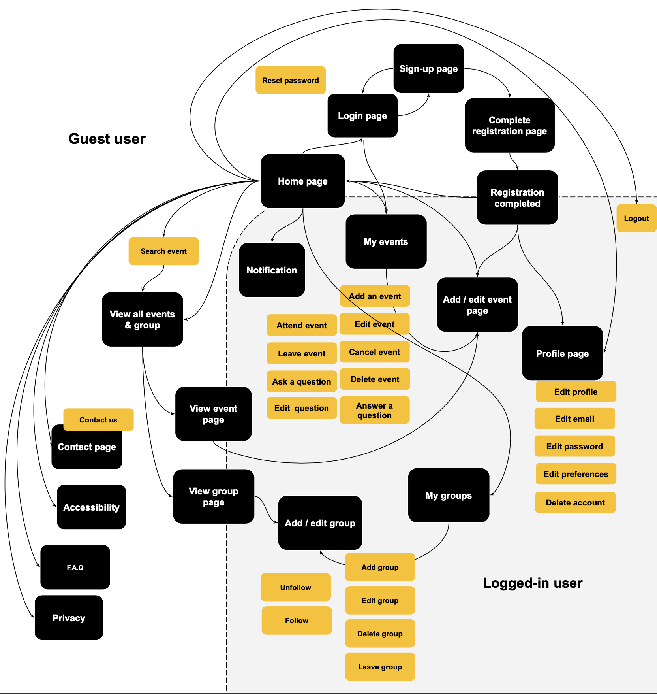

# **MS3 - Codzilla**

## **Introduction** 

[include screenshots of project on responsive devices]

Codizilla -  an online meetup-planning platform - was created for educational purposes only as part of the Code Institute’s full stack development course.

Using the principles of UX design, this fully responsive and interactive website was developed using HTML, CSS, JavaScript, Python, Flask and MongoDB. 

View live project here [link to deployed link]

## **Table of content** 

  - [UX Design](#ux-design)
    - [Strategy](#strategy)
    - [User stories](#user-stories)
    - [Scope](#scope)
    - [Structure](#structure)
    - [Skeleton](#skeleton)
    - [Design](#design)
  - [Features](#features)
    - [Existing features](#existing-features)
    - [Features left to implement](#features-left-to-implement)
  - [Technologies Used](#technology-used)
    - [Languages](#Languages)
    - [Libraries and frameworks](#libraries-and-frameworks)
  - [Testing](#testing)
  - [Deployment](#DEPLOYMENT)
    - [Deployment of the page](#deployment-of-the-page)
    - [How to run the code locally](#how-to-run-the-code-locally)
   - [Credits](#credits)
     - [Code](#code)
     - [Content](#content)
     - [Media](#media)
     - [Acknowledgment](#acknowledgments)

# **UX DESIGN**

- ## **Strategy** 

    Codizilla is an online event-planning platform, aimed at developers who, regardless of their experience, want to organise and participate in meetups in order to extend their skills, network and portfolio around:
    - a group or open-source project, 
    - a study group to learn and expand on a specific language or framework 
    - a working group to help each others with cvs and cover letters or
    - a drink to simply meet and socialize    
    
    The site owner, as a remote student on a full-stack development course, appreciates that it can be a lonely process and has enjoyed meeting with fellow students on the course, working and socializing together on an array of projects. 

    **Site owner goal**

    - To provide an easy and engaging community platform where users can create and join meetups
    - To expand on software development skills using Python, Flask and MongoDB
    - To create a minimum viable product that can be further developed with additional features   

    **User goals** 

    - To access a user-friendly website across multiple devices 
    - To build a community with other developers around shared-interests and collaborative projects by joining and/or organising meetups. 

- ## **User stories** 

    **As a new user:** 
    - I want a responsive website so that I can access it on different devices.
    - I want to easily navigate across the site so that I can find the information I need.
    - I want to search events without having to register so that I can assess if this website is for me
    - I want to view a details for an event so that I can see all the practical information 
    - I want to sign-up on the website so that I can join or organise an event
    - I want to read about how to use this website so that I can make the most of the features on offer.  

    **As a returning user:** 
    - I want to login on the website so that I can make use of all the features on the website 
    - I want to be able to edit my profile so that I can update my personal information
    - I want to set my preferences for my notification so that I don’t miss important information
    - I want to reset my password if I forgot it so that I can access my account
    - I want to be able to delete my profile so that my personal information is removed from the website        

    **As an event organiser:**
    - I want to create a group so that my events are easier to find
    - I want to easily create an event so that I can start meeting with other users
    - I want to view events that I have created so that I can manage my events
    - I want to post an answer to a question about a meetup I’m organising so that I can offer more details about the event.   

    **As a meetup participant:**
    - I want to easily join an event so that I can start meeting other users 
    - I want to be able to ask a question about the event  so that I can get more details about the event
    - I want to cancel my participation to an event
    - I want to view the events that I am planning to attend    

    **As a frequent user:**
    - I want to contact the site owner so that I can make queries about the website
    - I want to be able to edit an event so that I can reschedule or update details about the event
    - I want to be able to cancel an event so that attendees can get notified of the cancellation
    - I want to be able to delete an event so that I can manage my account more effectively
    - I want to view important notifications about my events so that I keep up-to-date.

- ## **Scope** 

    - ### **Feature trade-off**

        

        This website will be developed as a minimal viable product with room for future improvements and releases incorporating additional features.

    - ### **Functional requirements**
        - To be able to sign-up using email address and secure password
        - To be able to login 
        - To be able to add/view/edit/delete profile information and preferences
        - To be able to reset password 
        - To be able to add/view/edit/delete an event 
        - To be able to add/view/edit/delete a group
        - To be able to cancel an event 
        - To be able to search events according to keyword and set of criteria
        - To be able to sort meetup according to a set of criteria 
        - To be able to display search results 
        - To be able to add/view/edit/delete a question 
        - To be able to add/view/edit/delete an answer 
        - To be able to notify users when an event is about to take place, when an event has been changed or cancelled and when a question has been asked / answered
        - To be able to share events on social media
        - To be able to store and retrieve images 
        - To be able to contact the site owner 
        - To receive feedback for important actions: create - update - delete
        - Page 404 Not Found
        - Page 500 Internal Server Error page 

	- ### **Non functional requirements**
	
      - Display event location on a map
      - Display profile and event images 

    - ### **Content requirements**
        - Clear and concise information on how how to use the website 
        - Forms for user input 
        - Engaging text and headings throughout to display relevant user input such as profile page, events and groups as well as questions and answers
        - Background images to provide visually appealing and engaging interface
        - Icons for interactive and visual elements 

    - ### **Constraints**
	
      **Technical skills:**   
      The site owner is still learning Python, Flask and MongoD, which may impact on the successful implementation of the planned features. 

      **Time:**     
      Implementing features using new technical skills will require time and careful planning. 

- ## **Structure**

    - ### **Information architecture**

         
         Link to document (png format) [here](documentation/structure/architecture.png)

    - ### **Website workflow**

        
         Link to document (png format) [here](documentation/structure/workflow.png) 

    - ### **Organisation of functionality and content**

      **Header:** Logo and a collapsible menu for guest users. Once users are logged in, they will have access to certain functionality such as notification and add an event. Users will also have easy access to their profile, their events as well as their groups.   

      **Homepage:** Search option, information about and on how to use the website as well as a carousel of upcoming events,
    
      **Footer:** Contact form and useful links
    
      **All events and groups:** list of all events with search and sort option. Each event card will include important information: event title, date & time, location, number of attendees.
    
      **Event and group detail pages:** display all the information relevant event / group
    
      **Profile page:** to display all the relevant information about a user
    
      **View my events pages:** to display a summary of all the events organised as well events the user is attending / interested in.

      **View my group page:** to display a summary of all the groups for which the user is either a member or an organiser. 

      Other pages will have the primary purpose to collect information add/ edit information stored on the database such as user profile, events and groups.

    - ### **Interaction design**

        - Collapsible menu
        - Modal forms for editing profile and contact us page 
        - Buttons and content cards with hovering effects 
        - Icons with hovering effect

    - ### **Database structure**

        Database structure was designed using [diagram.io](https://dbdiagram.io). 

        

        Link to document (png format) [here](documentation/structure/db_structure.png) 

