# **FEATURES** 

[Return to main README](../README.md#implemented-features)

- ## **Implemented features** 

    - ### **Responsive layout** 

        The website resizes according to the device used for better visibility and user experience.    

         > As a new user, I want a responsive website so that I can access it on different devices.   

        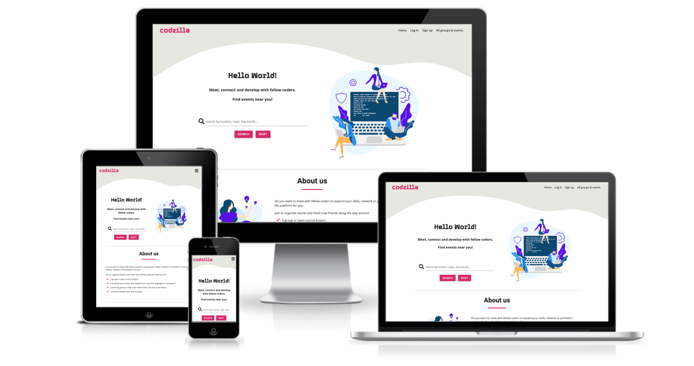

    - ### **Collapsible and interactive navigation menu**

        The website features a navigation menu on top of the page to allow users to easily navigate throughout the website. The navigation is collapsible on mobile devices for better visibility.

        Once a user is logged in, the navigation bar will update to functional icons allowing the user to access all the features on the website. If the user has new notification, a little indicator is displayed with the number of new notification.

        > As a new user, I want to easily navigate across the site so that I can find the information I need.
 
        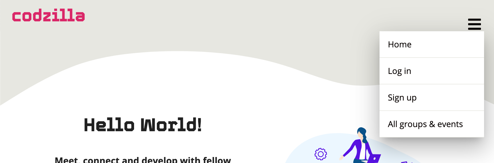

        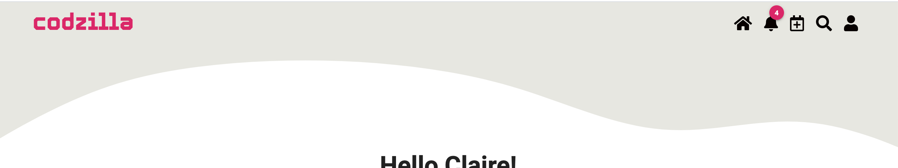
 
 
    - ### **Interactive design**
 
      All interactive elements - including icons, links and buttons - feature hovering effects and all modals include closing icons.   
 
      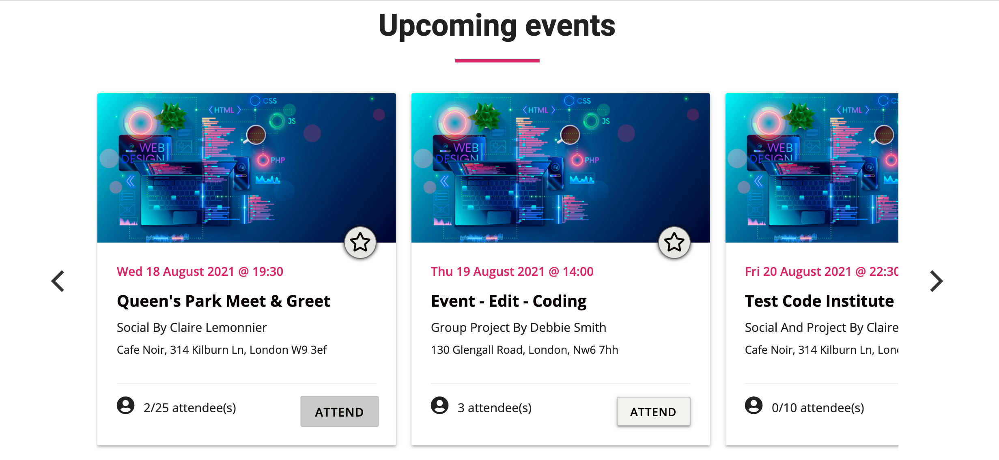
 
      Each event will display a button inviting the user to attend the event and a star for the user to mark his interest in the event. The user can simply click on attend to attend the event and the button will change to attending. In a similar way, the user can just click on the star to bookmark the event. Once clicked, both buttons will turn blue. 

      When clicking on attend or bookmark, if a user is not signed-in/registered a modal window will open prompting him to do so. 

      If the logged in user is the owner of the event, buttons for editing and cancelling the event will be displayed.

       > As a meetup participant, I want to easily join an event so that I can start meeting other users
       > As a meetup participant, I want to cancel my participation to an event
       > As a frequent user, I want to be able to edit an event so that I can reschedule or update details about the event
       > As a frequent user, I want to be able to cancel an event so that attendees can get notified of the cancellation 

    
    - ### **Homepage**

      The homepage features a search functionality that displays results in the ‘browse all groups and events’ page.    
 
      The homepage also features sections  ‘about us’ as well as a section displaying upcoming events and a section explaining how to use the website, giving the user a good and an engaging overview of what the website is about.   
 
      > As a new user, I want to search events without having to register so that I can assess if this website is for me
      > As a new user, I want to read about how to use this website so that I can make the most of the features on offer.   
 
      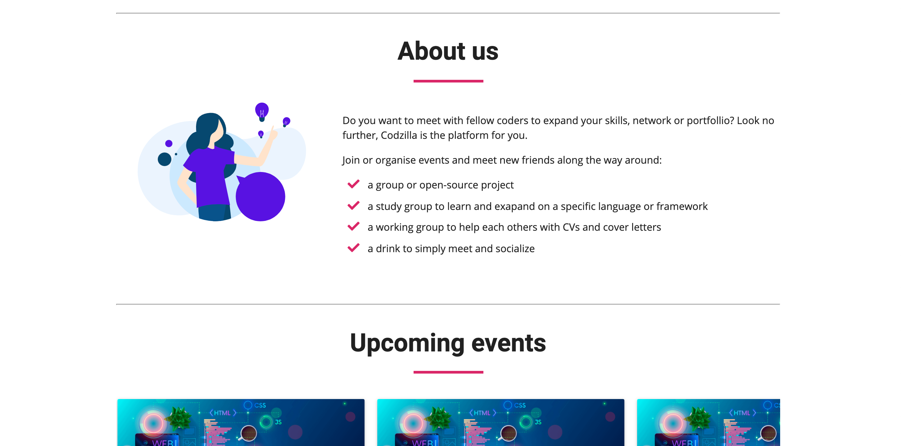

      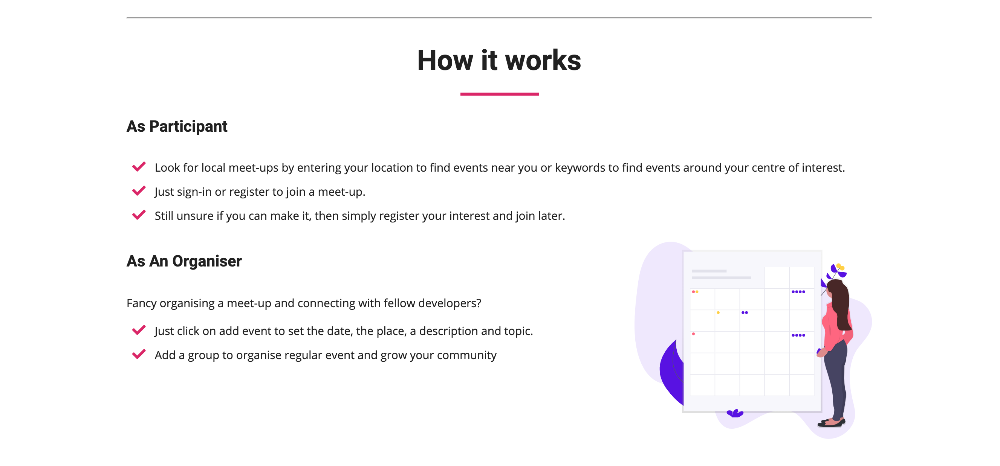
 
 
    - ### **Search functionality**
 
      The search functionality features in both the homepage and the ‘Browse all groups and events’ page. The user can search groups and events alike by typing a location, a topic or key words.    
 
      When submitting a search from the homepage, the user is  redirected to the ‘Browse all groups and events page’ where the results for that search are displayed.    
 
       > As a new user, I want to search events without having to register so that I can assess if this website is for me.  

      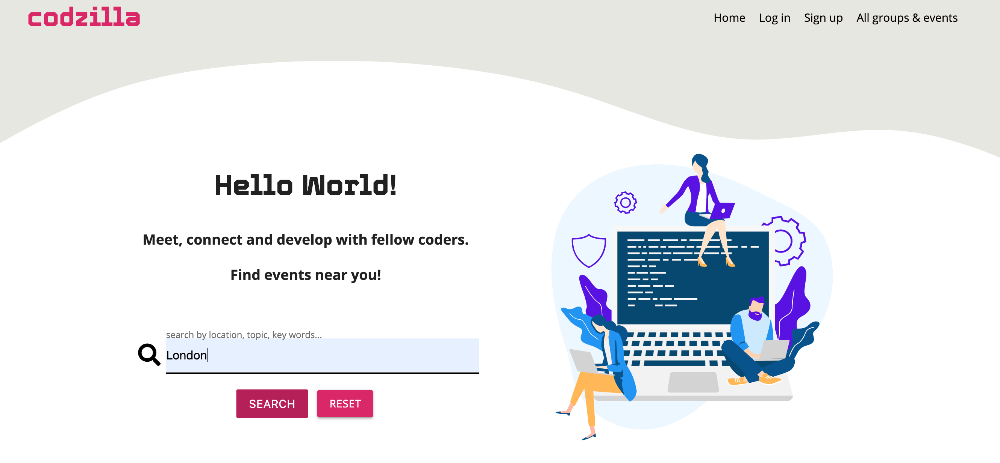

    - ### **Browse all events and groups**
 
       This page features a search functionality as well as summaries of all the groups and events. Each summary displays a cover banner as well key information and a link redirecting to the event or group details page accordingly so that the user can find out more detailed information.     

       The user is able to switch between groups and events using the tab navigation bar at the top of the page.   

       > As a new user, I want to search events without having to register so that I can assess if this website is for me
       > As a meetup participant, I want to easily join an event so that I can start meeting other users    

 
    - ### **Footer**

         The footer features useful links to other sections of the website as well as a button opening a modal form allowing the user to contact the website owner by completing the form.    

         > As a frequent user, I want to contact the site owner so that I can make queries about the website.  
 
         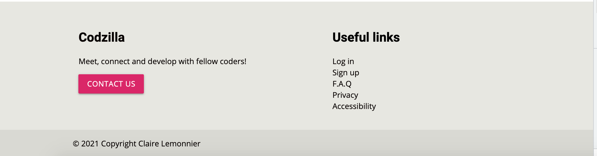
 
    - ### **Sign up page**

         This page features a form asking the user for its first name, last name and email address.     

         Upon signing up, a ‘complete your profile page’ will display where the user is able to add a profile image (via url), his location and set his notification preferences.   

         Once completed the user is redirected to a landing page calling for the following action: add an event, go to homepage, browse all groups and events.      

         > As a new user, I want to sign-up on the website so that I can join or organise an event.  

         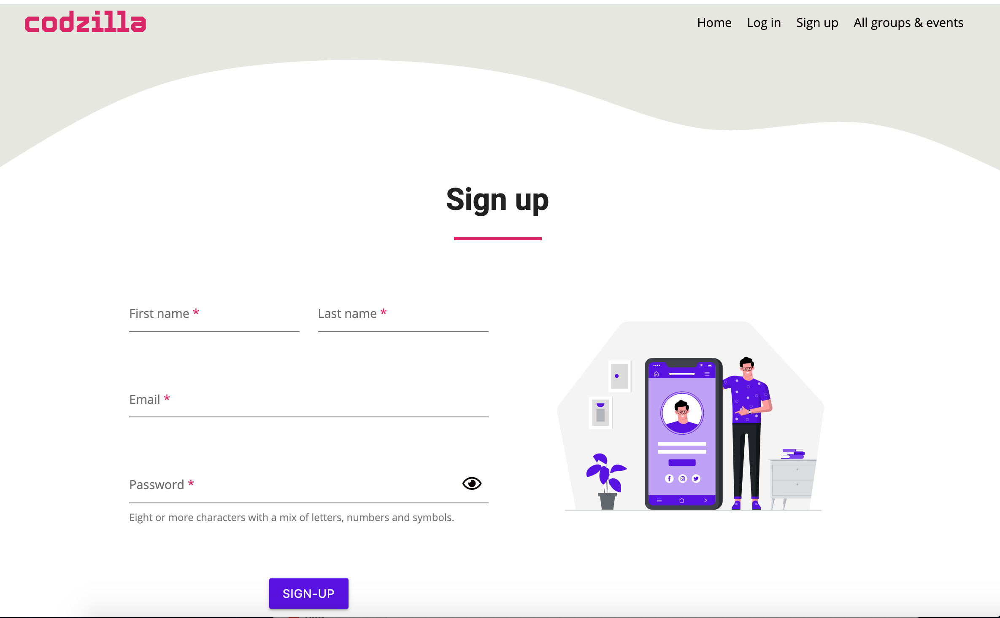

    - ### **Login page**

        The login page features a form asking the user for his email and password.  The password can be made visible using by toggling the eye icon.     

        Upon successfully login the user will be redirected to a landing page and the navigation bar will update with functional icons to access all the features of the website such as adding an event, managing groups and events as well as viewing notification.    

         - Once logged in, the user is able to:
         - Add / edit / delete an event
         - Add / edit/ delete a group 
         - Edit / delete his profile 
         - Attend / unattend an event 
         - Follow / unfollow a group    

         The login page also features a link allowing the user to reset his password.      

         Upon logging in, the user nofification will update with event reminder according to user preferences. 

         > As a returning user, I want to login on the website so that I can make use of all the features on the website    
 
         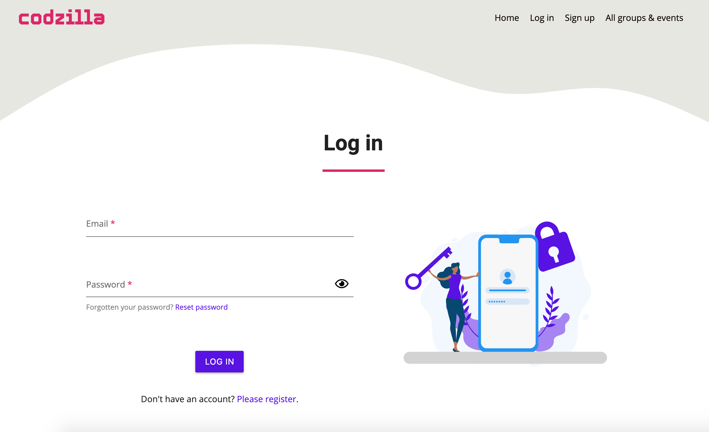

    - ### **Reset password**

         The user will be asked for his email and a reset link with a token will be sent to the email address provided should it exist in the database.    

         Once clicking on the reset link, the user is redirected to form prompting for a new password and confirmation of that password.   

         Upon the submitting the new password the user is redirected to [].  

         > As a returning user, I want to reset my password if I forgot it so that I can access my account.      

         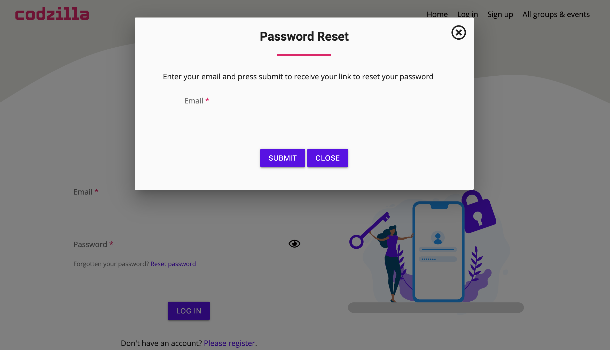

    - ### **My profile page** 

         My profile page features the user’s personal information, account settings and notification preferences. The user is able to edit each section as well as changing his password using modal forms. The page will be updated upon submitting the new information.   

         This page also features the ability for the user to delete his account. Upon clicking delete, a confirmation modal opens so that the user doesn’t delete his account by accident.     

         > As a returning user, I want to be able to edit my profile so that I can update my personal information  
         > As a returning user, I want to be able to delete my profile so that my personal information is removed from the website   
         > As a returning user, I want to set my preferences for my notification so that I don’t miss important information     

         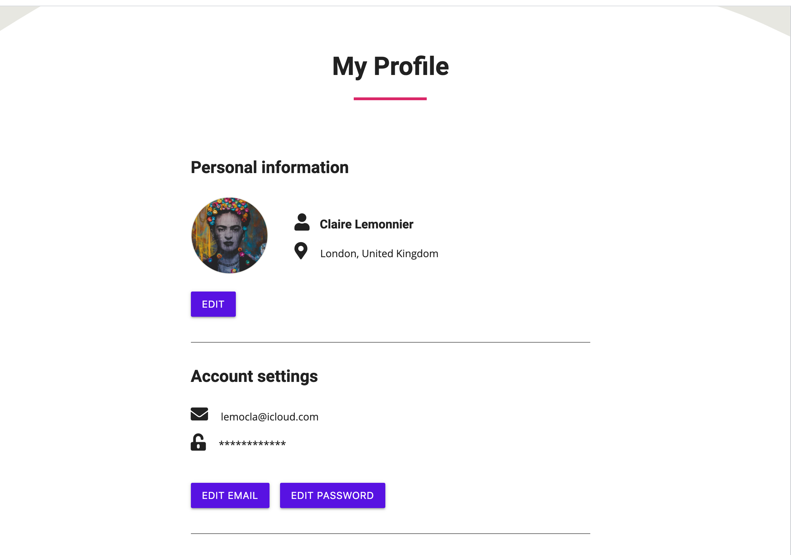

         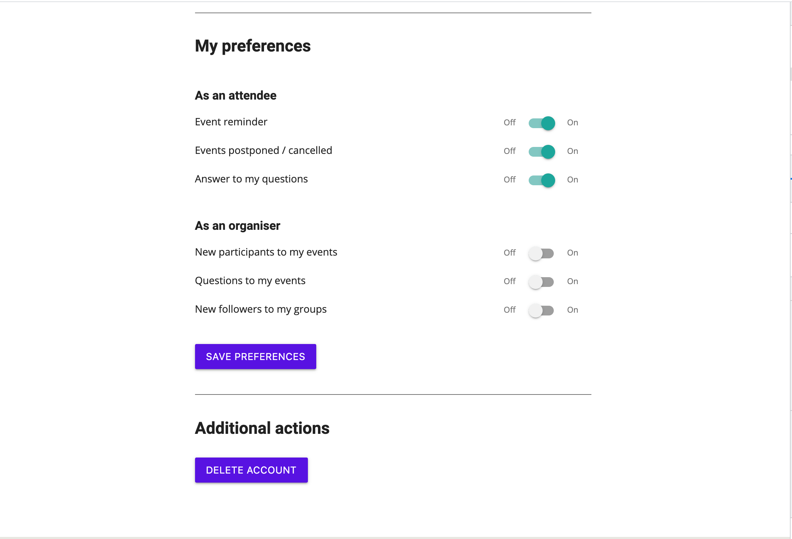

    - ### **Event detail page**

         This page features all the information about the event including dates, location, event description, attendees and questions and answers.   

         If logged in, a user can bookmark, attend and ask a question about this event.  

         As an event event organiser, the user will be able to edit, cancel or delete the event.   

         > As a new user, I want to view a details for an event so that I can see all the practical information
         > As a meetup participant, I want to easily join an event so that I can start meeting other users
         > As a meetup participant, I want to be able to ask a question about the event  so that I can get more details about the event
         > As an event organiser, I want to post an answer to a question about a meetup I’m organising so that I can offer more details about the event.   

         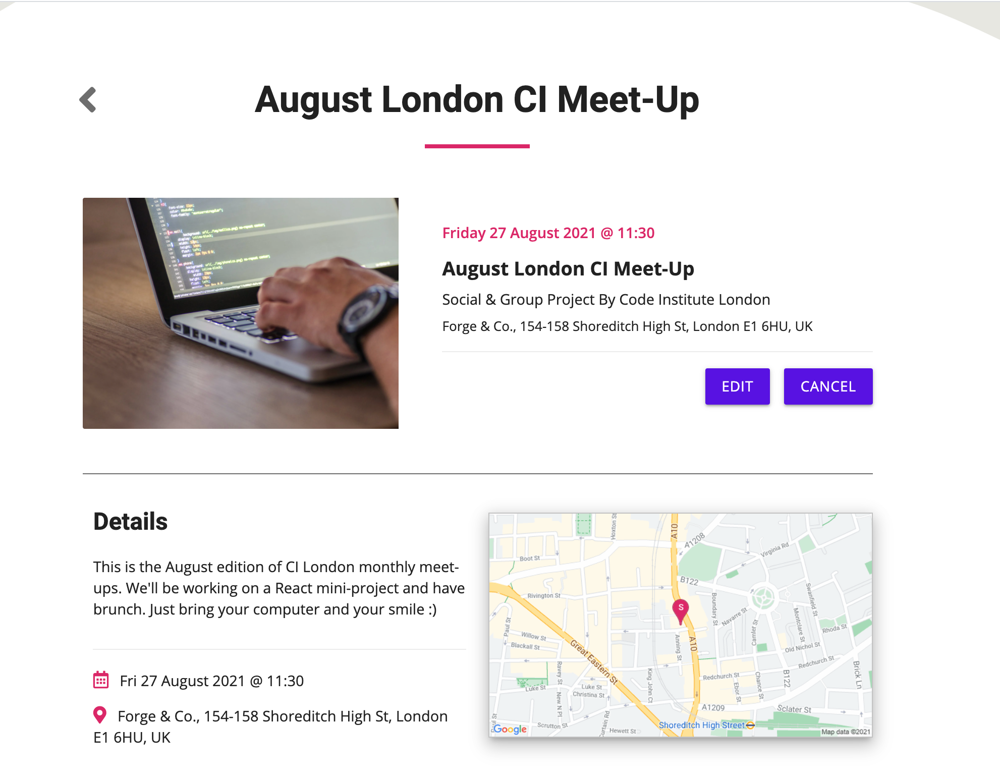

         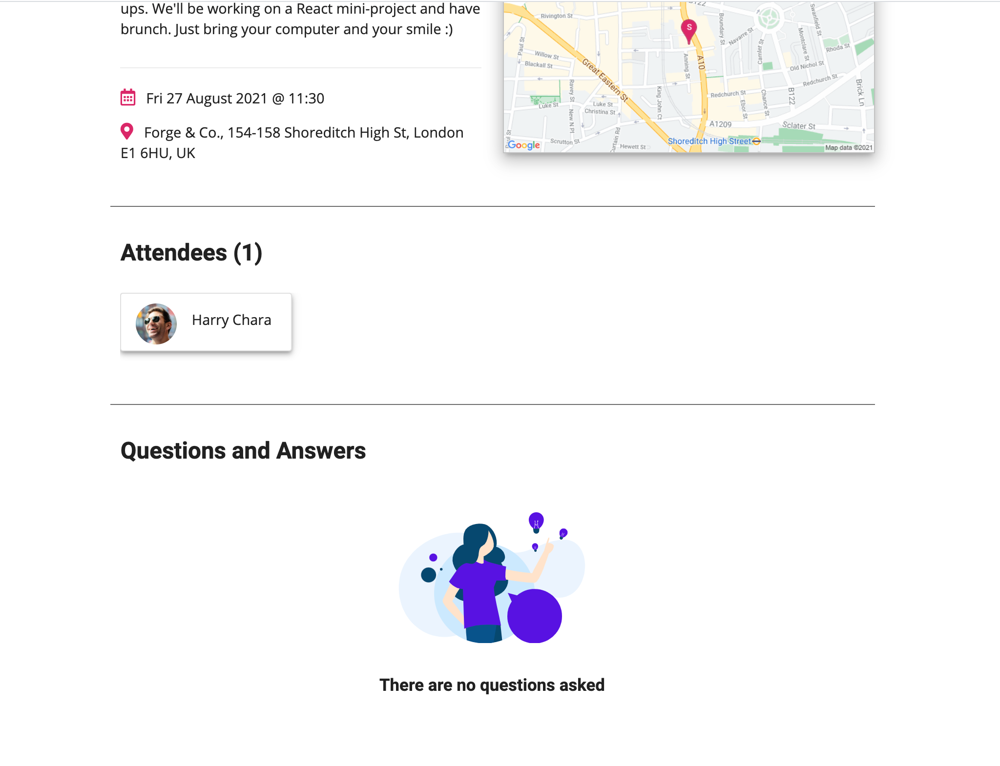

     - ### **My events**

         This page features events the user is organising, events the user is attending and events the user is interested in (bookmarked events).   

         Using the tab navigation the the user is able to switch between the different categories and manage his events accordingly:   

         A user can:
         - Add / edit / delete an event 
         - Attend / unattend an event 
         - Remove bookmark if he’s no longer interested in the event.         

            > As an event organiser, I want to view events that I have created so that I can manage my events
            > As a meetup participant, I want to view the events that I am planning to attend 
            > As a frequent user, I want to be able to edit an event so that I can reschedule or update details about the event
            > As a meetup participant, I want to cancel my participation to an event
            > As a frequent user, I want to be able to cancel an event so that attendees can get notified of the cancellation
            > As a frequent user, I want to be able to delete an event so that I can manage my account more effectively. 

         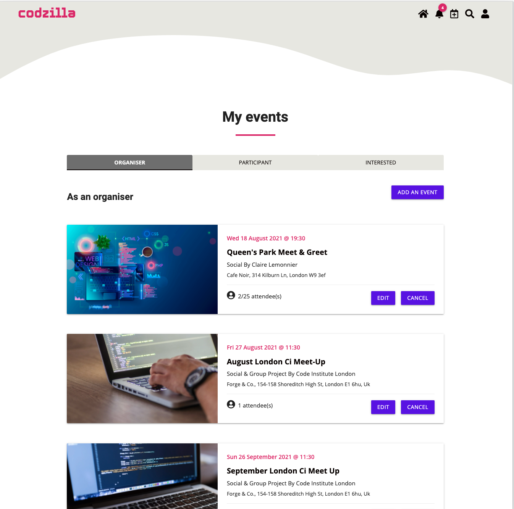

    - ### **Add an event page**

        This page features a form allowing the user to add an event once he has completed the relevant information.       

         > As an event organiser, I want to easily create an event so that I can start meeting with other users. 

         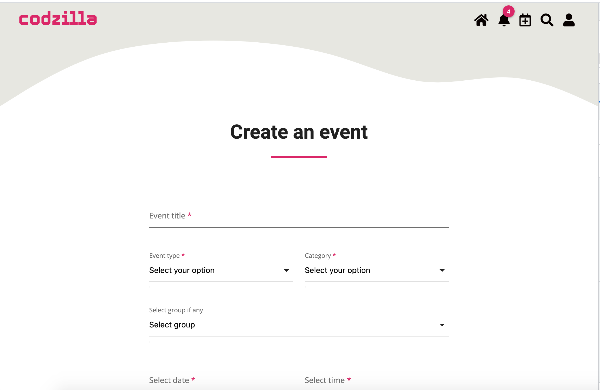

    - ### **Edit an event page**

         This page features a form allowing the user to edit information related to an event. From this page the user can also cancel an event.       

         > As a frequent user, I want to be able to edit an event so that I can reschedule or update details about the event. 

     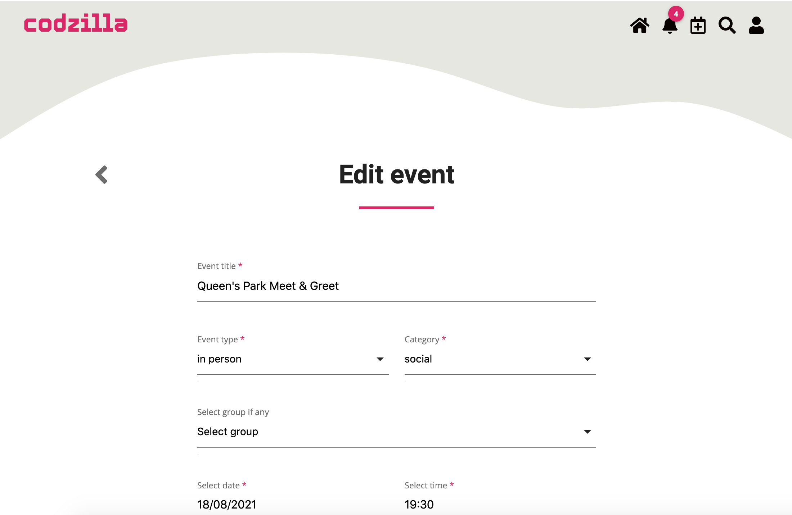

    - ### **My groups** 

         This page features all the groups the user owns and follows.  

         Using the tab navigation the the user is able to switch between the different categories and manage his group accordingly: 

         A user can:
         - Add / edit / delete a group
         - Follow / unfollow a group.        

        > As an event organiser, I want to create a group so that my events are easier to find. 
 
     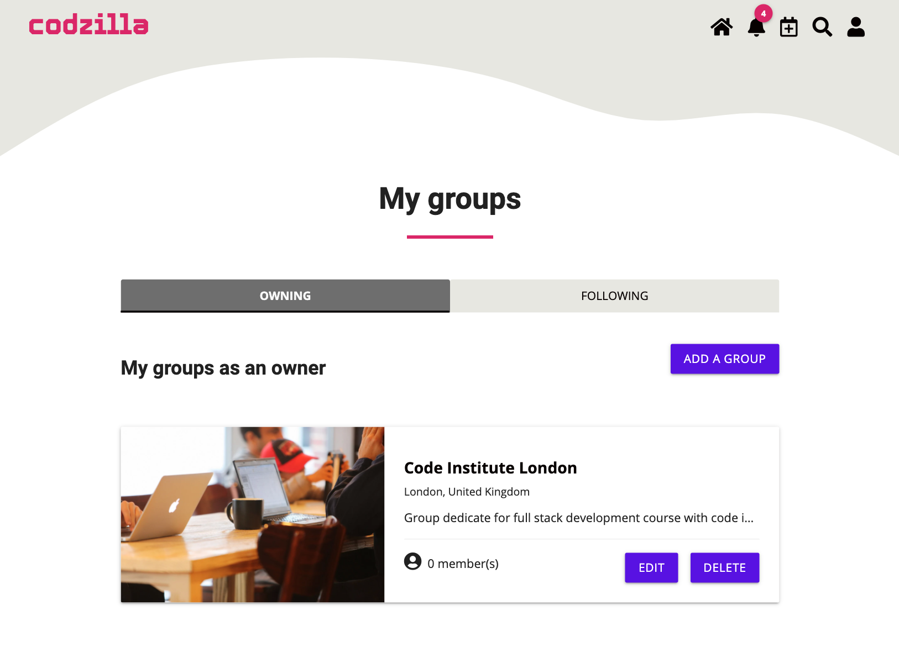
 
    - ### **Group detail page**

         This page features all the information related to a group including image cover, group name, description, followers and upcoming events for that group.    

         - A user can follow or unfollow a group 
         - A group admin can edit / delete a group 
         - A user can attend / unattend  / bookmark an event 
         - A group admin can add / edit / cancel / delete an event.   

        > As an event organiser, I want to create a group so that my events are easier to find

        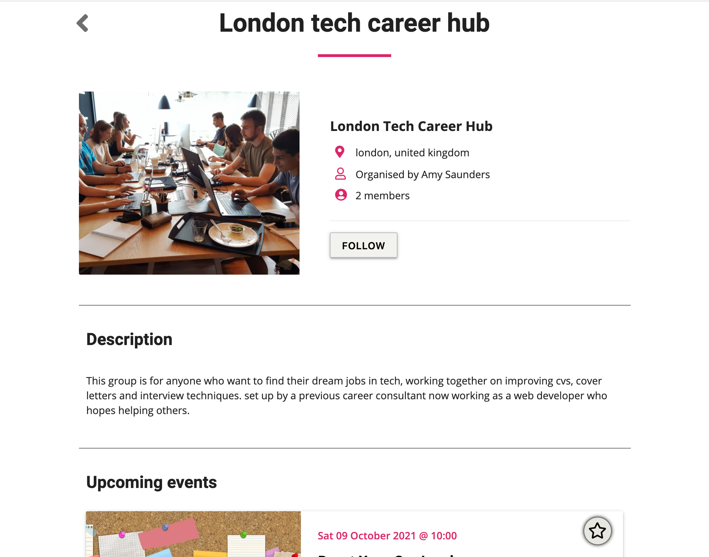

    - ### **Notification page** 

        This page displays all the notification messages according to the user’s preferences:
            - Event reminders to inform attendees about an event happening soon 
            - Event cancellation notification so that attendees do not turn up to the event
            - Answer to user’s question so that user can quickly get the information needed
            - New participant notification so that the organiser can keep track of the interest into an event
            - Questions to an event notification so that the organiser knows that he needs to provide an answer
            - New followers so that users can keep track of interests into his groups.   

        The user is able to delete notifications. 

        > As a frequent user I want to view important notifications about my events so that I keep up-to-date.  

       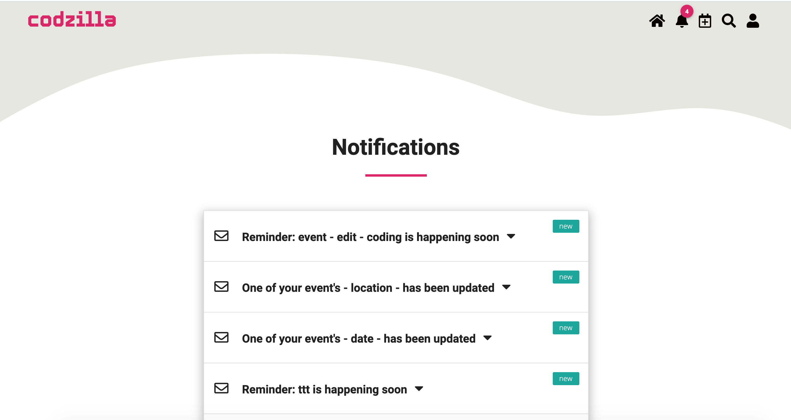

    - ### **Frequently asked question page**

        This page features a range of questions and answers helping the user to make the most of the features available on the website.   

        > As a new user, I want to read about how to use this website so that I can make the most of the features on offer.

        

    - ### **Accessibility statement**

        This page features the accessibility statement, indicating the site owner’s best effort to make the website accessible to all users.  

        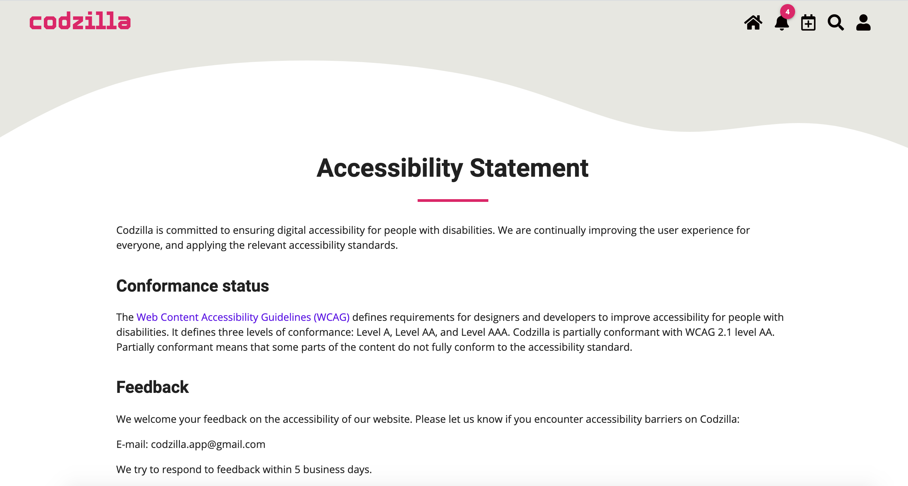

