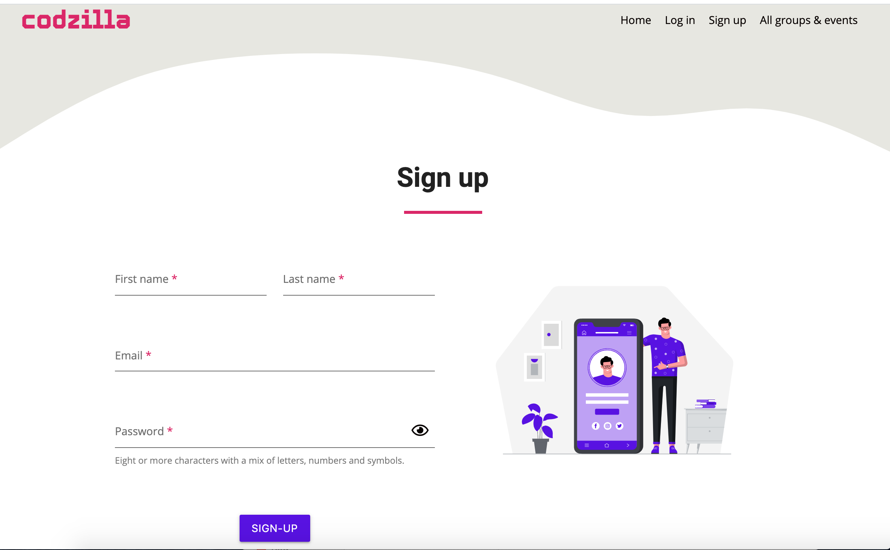
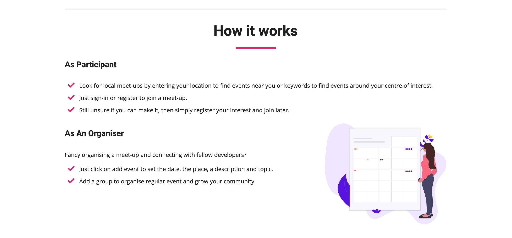
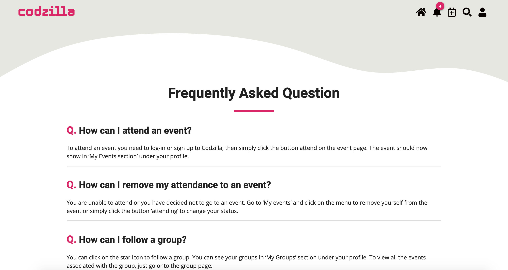
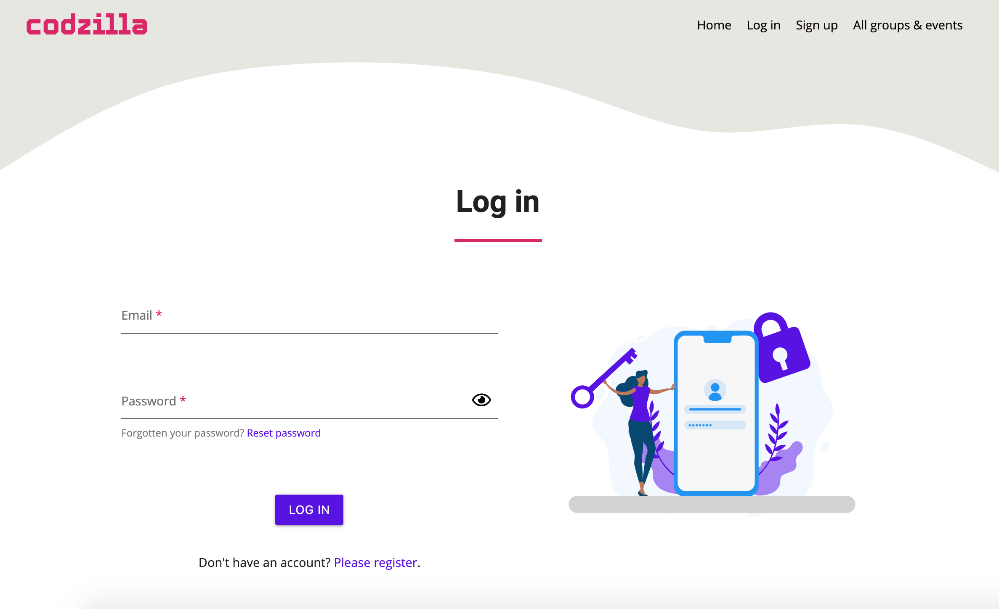
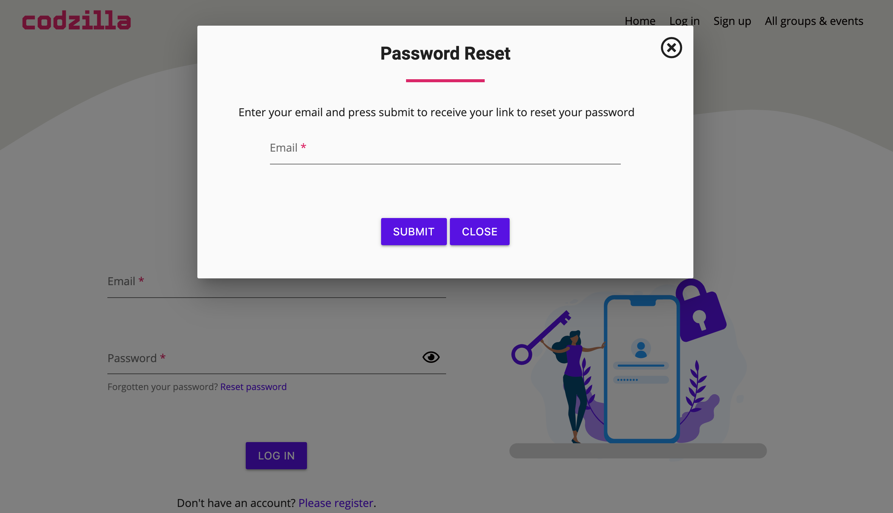
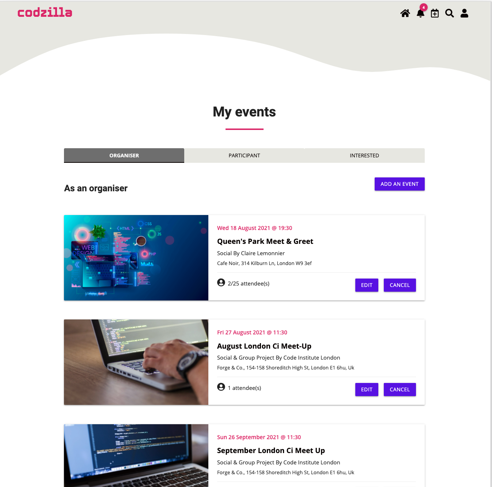
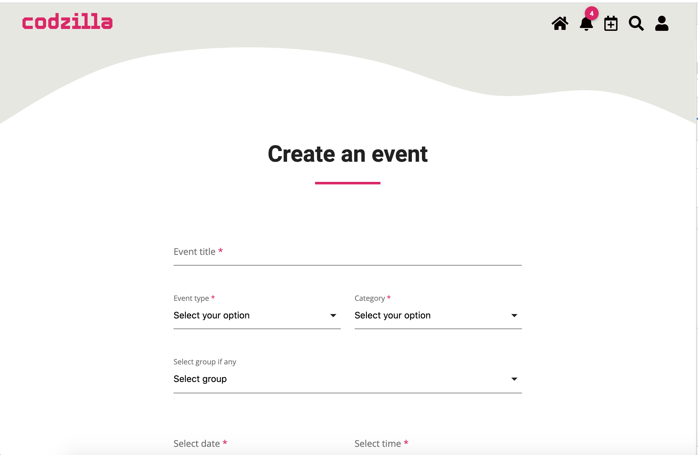

# **Testing user stories**

[Return to main README](../README.md#testing-user-stories)

- ## **As a new user, I want a responsive website so that I can access it on different devices**

     - When I visit the website using my device, the content is optimized for that device
     - On a mobile and tablet the navigation bar is collapsed 
     - When the navigation is collapsed, a toggle button is displayed to right of the header, and
     - When I click on the toggle button, a vertical menu is displayed,
     - When I click again on the toggle button, the vertical menu collapses back.    
     - **Results**: Pass

     

*****	
- ## **As a new user, I want to easily navigate across the site so that I can find the information I need**
	
     - When I click on a menu item in the navigation bar, the relevant page is displayed without errors. 
     - When I click on a link in the footer, the relevant page is displayed without errors.  
     - **Results**: Pass
***** 
- ## **As a new user, I want to search events without having to register so that I can assess if this website is for me**
	
  - ### **From homepage**. 

     - When on the homepage, I can enter key words in the search field and, 
  	 - When I click search, I am redirected the "browse all groups and events" page and,
  	 - If there’s a match, the results are displayed 
  	 - If there isn’t any match, the message "no results found" is displayed along with an illustration.     
  	 - **Results**: pass

  - ### **From all groups and events**    

  	 - When on "all groups and events" page and I repeat the above steps and,
  	 - When I click search, the page is updated with the results if there’s a match,
  	 - and if not, the message "no results found" is displayed along with an illustration.     
  	 - **Results**: Pass       

		
	  

***** 
- ## **As a new user, I want to view thr details for an event so that I can see all the practical information** 
	
     - When I look at upcoming events on the homepage, or when I browse all events and,
     - When I hover over the event card, its appearance changes 
     - When I hover over the event title, its appearance changes 
     - When I click on the event title, I am redirected to the event page.     
     - **Results**: Pass

     

     

***** 
- ## **As a new user, I want to sign-up on the website so that I can join or organise an event**

     - When I click on sign-up link in either the navigation bar or the footer,
     - A form asking for a first name, last name, email and password is displayed.   
     - **Results**: Pass

     

  - ### **Acceptance criteria - Form invalid path**
	- when I enter invalid information in the “first name” field or leave the field empty, and/or
	- When I enter invalid information in the “last name” field and or leave the field empty, and/or
	- when I enter an invalid email address in the “email” field or leave the field and if
	- When I enter an invalid password or leave the password field empty,
	- Errors messages will display and I will be prompted to input valid information and 
	- I won't be able to submit the form.    
    - **Results**: Pass

     

  - ### **Form valid path**
	- when I enter my first name in the “first name” field and
	- When I enter my last name in the “last name” field and,
	- when I enter a valid email address in the “email” field and,
	- When I enter a valid password of a minimum of 8 characters including a mix of letters, numbers and symbols including a capital letter,
	- I am redirected to complete your profile page.  
    - **Results**: Pass

	 

	 

  - ### **Complete profile page valid path**
     - When I am redirected to the complete my profile page, a form is displayed asking me to provide an image url, my city and my country as well as my preferences for my notification.
     - If enter all the valid information, I am redirected to the landing page. 
     - ***Results**: Pass

	 

  - ### **Complete profile invalid path**
     - If I submit the form but have not completed the fields for city and country, I will be prompted to fill these fields and the form will not submit. 
     - **Results**: Pass

	 

     - If I submit an invalid url, an error message will display and if I happen to enter an image url that isn't recognised an image, an error message will be displayed on my profile page to inform me that my profile couldn't be updated.
     - **Results**: Pass

	  

*****
- ## **As a new user, I want to read about how to use this website so that I can make the most of the features on offer.**

   - When I scroll down the home page, there's a section "about us" and,
   - When I scroll further down, there's a section on how to use the website.   
   - **Results**: Pass
	
	 

   - When I scroll down to the footer, I can see that there is a "frequently asked question" link and,
   - When I click on that link the frequently asked question page is displayed.
   - **Results**: Pass

     

*****
- ## **As a returning user, I want to login on the website so that I can make use of all the features on the website** 

	- When I click on the "Log in" link in the navigation bar or footer,
	- A form asking for my email and password is displayed.   
   	- **Results**: Pass

	  

	- ### **Form valid path**
	  - When I enter my email in the “email” field and
	  - When I enter my password in the “password” field and,
	  - If the information match my account, I am redirected to the "landing page" if my profile is complete or "complete my profile page" is my profile is incomplete
	  - **Results**: Pass

	  

	- ### **Form invalid path**
	  - If I enter the wrong password, I am redirected to the landing page with message informing me that the pasword is incorrect
	  - **Results**: Pass

    - ### **Form invalid path**
	  - If I enter invalid email in the “email” field or leave the field empty, and/or
	  - If I leave the passwowrd field empty,
	  - A message will display and I will be prompted to fill valid information and 
	  - I won't be able to submit the form.  
	  - **Results**: Pass

	  

*****	  
- ## **As a returning user, I want to be able to edit my profile so that I can update my personal information**
	- When I have successfully logged in and,
	- When I click on the user icon, a dropdown menu is displayed,
	- When I click on my profile, I am redirected to my profile page
	- **Results**: Pass 
	
	  

	- ### **Edit profile**
	  - When I click on edit my personal information, a modal form will display, 
	  - When I edit a field in my personal information in the valid format,
	  - The modal form closes and my profile page is updated with the edited information with a message informing me that my profile has been successfully edited
	  - **Results**: Pass 

	  	
	
	- ### **Edit profile invalid path**
	  - If I enter information in an invalid format or
	  - A message error under the relevant field will display prompting me to enter the right information 
	  - If I happen to enter an image url that isn't recognised an image, an error message will display on my profile page to inform me that my profile couldn't be updated.
	  - **Results**: Pass

	- ### **Edit my password - valid path**
	  - When I click on edit my password, a modal form will display
	  - When I enter my existing password and that my existing password is correct, 
	  - When I enter my new password and confirm my new password and that both these fields match,
	  - And I click on submit,
	  - The modal form closes and my profile page displays a message informing me that my password has been successfully updated.
	  - **Results**: Pass

	- ### **Edit my password - invalid path**  
	 - If enter the wrong existing password an error message will display under the field, 
	 - If I enter a password that does not a contain 1 capital letter, a number or a symbol, a error message will display to let me know that I should enter the information in the right format. 
	 - And if my new password and confirm my new password don't match, an error message will display prompting me to match both passwords,
	 - **Results**: Pass

	 

	- ### **Edit my email**
	 - When I click on edit my email, a modal window will open,
	 - When I enter a valid email address and click on submit, 
	 - The modal will close and my profile will be updated with edited information with a message informing me that my password has been successfully edited. 
	 - If I enter invalid email and if the new and confirmation email do not match, errors messages will be displayed to the user
	 - **Results**: Pass

	  

*****
- ## **As a returning user, I want to set my preferences for my notification so that I don’t miss important information**

	- When I am on my profile page, my preferences for notification are displayed,
	- I can toggle each of them on and off and,
	- When I click save my preferences, the profile page is updated with my changes

	  

*****
- ## **As a returning user, I want to reset my password if I forget it so that I can access my account**
 
  - ### **Acceptance criteria**
	- When on the login page, the link to reset the password is displayed 
	- When I click on the reset your password link, a modal form is displayed
	- When I enter my email address and my address is valid
	- When I click on submit, I am redirected to the login page and a flash message is displayed 
	- Once I receive my email and I open it in time, I am redirected to a page where I can enter my new password and confirm this new password, 
	- If both passwords match, when I click submit I am redirected to the landing page. 
    - **Results**: Pass 

	 

 *****
- ## **As a returning user, I want to be able to delete my profile so that my personal information is removed from the website** 
	- When I am on my profile page and I scroll down the page,
	- A button "delete" is displayed and when I hover over the button its appearance changes
	- When I click on "delete", a modal window will open asking me to confirm if want to delete my profile, 
	- When I click on "submit", my profile is deleted and I am redirected to the sign up page.
	- **Results**: Pass

	 

*****
- ## **As an event organiser, I want to create a group so that my events are easier to find**

	- When I am logged in and when I click on the user icon and that the dropdown menu is displayed, 
	- When I click on my groups, my groups page is displayed
	- When I am on the under the tab labelled "owning", a button "Add a group" is displayed.
	- When I click on "Add a group" button, I am redirected to the "add a group" page that features a form, and
	- The city and country should auto-filled matchting the one on my profile

	 

	- #### **Valid path**
	  - When I enter a group name and that the group name doesn't exist on the database,
	  - When I enter a valid image url 
	  - When I enter a valid description 
	  - And I click submit, I am redirected to my groups page where my new group is displayed with a message informing me that my group has been successfully added 

	    

	- #### **Invalid path**
	  - When I enter a group name and that group name already exist on the database,
	  - An error message will display prompting me to choose a different name
	    

	  - When I enter an invalid image url, an error message will display and 
	  - If upon submit the image url is not valid and when I am redirected to my groups page, a message is displayed informing me that my group couldn't be added because the image is invalid. 

	  - When I enter an invalid city and country, an error message will also display asking me to match the accepted format.

*****
- ## **As a meetup participant, I want to view the events that I am planning to attend**
- ## **As an event organiser, I want to view events that I have created so that I can manage my events**

	- When I am logged in and that I can click on the user icon, a drop dropdown menu is displayed and,
	- When I click on my events, I am redirected to my events page,
	- By default, the selected tab at the top of the page is set "organiser", 
	- I can easily switch view between events I've organised, events I'm attending and events I'm interested in. 
	- Each event will have buttons to allow me to:
		- edit / cancel an event if I am the organiser
		- attend / unattend an event and wheter I am interested or not in the event.
	- **Result**: Pass
	
	  

	  

*****
- ## **As an event organiser, I want to easily create an event so that I can start meeting with other users**

	- When I am on my groups or my events page, 
	- I can see a button "Add Event"
	- When I hover over the button, its appearance changes and when I click on the button, 
	- I am redirected to add an event page where a form is displayed 

	 

	- ### **Dynamic display**
	   - If I select the event type as online event, the adress field will be hidden and instead an url field will display
	   - If I select the event type as in person, the location field will be made mandatory and if the url field is no longer displayed.
	   - When I click on add end time, an additional time picker field will be displayed, 
	   - If I toggle add end time, the time field is no longer displayed.
	   - **Result**: Pass 

	- ### **Form valid path**
	   - When I enter all the required fields, in the required format and that I click on submit, 
	   - I am redirected to either my groups or my events page with a message informing me that my event has been successfully added.
	   - **Result**: Pass

	     

	- ### **Check on location field**
	   - When I start typing in address field, a dropdown menu from google will display with suggested addresses, 
	   - if I select the address, it will inserted as the value of the input field. 
	   - if I don't select an address from the dropdown menu, an error message will display prompting me to select a valid address.
	   - **Result**: Pass 

	     

	     

	- ### **Check on image url**
	  - When I enter an invalid image url, a message error will display prompting me to use a valid url.
	  - When I click on submit and that my image url is not recognised as an image and when I am returned to either my events or my groups page, an message will be displayed informing that my event couldn't be added as my url was not valid.
	  - **Result**: Pass 

	     

*****
- ## **As a frequent user, I want to be able to edit an event so that I can reschedule or update details about the event**

	- When I navigate to my events or my groups, and that I am either in the tab organiser or owner, 
	- I can see an edit button
	- When I hover the edit button its appearance changes and when I click on the edit button, 
	- I am redirected to edit my event page, 
	- In a similar way as when I add an event, if all the information are valid, I am either redirected to my events or my groups page with a message informing me that my event has been successfully added. 
	- If any of the information is invalid - as explained above in add an event - message error will display and will be prevented from editing my event. 
	- If by any chance, I entered an invalid url but that matched the format, a message will be displayed in my event informing me that my event couldn't me added as my url was not valid.
	- **Results**: Pass 

	  

*****
- ## **As a frequent user, I want to be able to cancel an event so that attendees can get notified of the cancellation**

	- From my events, my groups or the event page,
	- The button "cancel" is clearly displayed for my events
	- When I click on "cancel", a modal window asking if I want to cancel the event will display,
	- Whe I clikc on "confirm", I am redirected to the event page with a message informing me that my event has been successfully cancelled.
	- **Result**: Pass

	  

	  

*****
- ## **As a frequent user, I want to be able to delete an event so that I can manage my account more effectively**

	- From my events, my groups or the event page,
	- Once I have cancelled an event, the button "delete" will be displayed 
	- When I click on the "delete" button, a modal window asking if I want to delete the event will display,
	- Whe I click on delete, I am redirected to my events page with a message informing me that my event has been successfully deleted.
	- **Result**: Pass

	  

	  

*****
- ## **As a meetup participant, I want to be able to ask a question about the event so that I can get more details about the event**
	- When I am logged in and that I am on an event page and when I scroll down the page, 
	- I can see a button ask a question that changes appearance when hovered over, 
	- When I click on ask a question a modal window will open, 
	- When I enter a question and click submit, the event page will referesh with my question 
	- If I leave the question field blank, I will be prompted to fill the field.
	**Result**: Pass 

	  

	  

	According to their preferences, the event organiser will receive a notification about the question.

*****
- ## **As an event organiser, I want to post an answer to a question about a meetup I’m organising so that I can offer more details about the event.**

	- When I am logged in and
	- If I received a notification informing me that I have a question about one of my event or, 
	- I am browsing the event page and when I scrolled down to the bottom of the page, I can see a button to answer the question that changes appearance when hovered, 
	- When I click on the button answer, a modal window will open and,
	- When I enter an answer and click sumbit, the event page will refresh with the answer to my question. 
	- **Results**: Pass
	 
	 

	 
	
	According to their preferences, the user who asked the question should receive a notification that their question has been answered.

*****
- ## **As a meetup participant, I want to easily join an event so that I can start meeting other users** 

  - When I am logged in and I browse events, I can see the button "attend",
  - When I hover on the button, its appearance changes and 
  - When I click "attend", the button changes to "attending" and the event will be displayed in my events  under the "participant" tab.
  - **Result**: Pass

     

     

*****
- ## **As a meetup participant, I want to cancel my participation to an event**

  - When I am logged in, 
  - I can see the events I am taking part in throughout the website,
  - When I click on "attending", a button "unattend" will be displayed and,
  - When I click on "unfollow", the button will revert to the default "attend" button. 
  - **Result**: Pass

     

*****
- ## **As a frequent user, I want to contact the site owner so that I can make queries about the website**

     - When I scroll down to the footer, I can see a the pink button "contact", 
     - When I hover over the contact button, its appearance changes and,
     - When I click on the contact button, I am redirected to a contact page which features a contact form.
  
    - ### **Valid path**
      - When I enter all the valid information, including my full name, my email address and a query message, and
      - I click on submit, 
      - The page refresh with a message informing me that my message has been sent successfully.
      - Once I have contacted the owner, I should receive an acknowlegment email. 
      - **Result**: Pass

         
 
     - ### **Invalid path**
       - If I leave or enter an invalid information in any of the fields, I will be prompted to fill or to enter valid information. 
	   - **Result**: Pass
 
*****
- ## **As a frequent user, I want to view important notifications about my events so that I keep up-to-date.**

     - ### **Acceptance criteria**
	     - When I log in, I can see if I have new notifications thanks to the bubble with the number of notifications in the menu
	     - When I click on the notification icon, the notification page opens with the header of the message being displayed.
	     - When I click on the heading of the message, its content is displayed with a button to view the event/group and a button to delete the nofication and 
	     - If the message is new, then the new label will disappear and the number of new notification will decrease by one.
	     - **Result**: Pass

	     

	      
	  
	